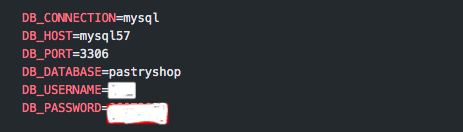

# Pastry Shop API - Laravel Demo App
## Your Welcome

## Sejam bem vindos a api Patry Shop, a seguir iremos fazer um passo a passo de como efetuar a instalação no seu ambiente local, para rodar a aplicação da API.

### Nesta aplicação estaremos utilizando as seguintes ferramentas:

- Docker: version 20.10.8
- PHP: version 7.4.33
- Laravel Framework: 6.20.44
- MySQL: version 8.0.33
- Git para baixar o projeto no repositorio

>Para iniciar o deploy do projeto no ambiente local devemos ter o Docker instalado corretamente na sua máquina.
Ter o gerenciador de versionamento Git.

1. Vamos fazer o checkout do projeto.
>
    git clone https://github.com/eduardo1520/pastryshop.git
> - Após efetuarmos o download da nossa aplicação podemos mudar as configurações para o acesso ao banco de dados no arquivo **.env**
> - criei um arquivo .env

> 

2. Com o docker rodando corretamente na sua máquina já podemos dar procedimento na instalação da aplicação.
Na raiz do projeto execute o seguinte comando para baixar e subir os container da aplicação.
>    
    docker-compose up -d

3. Com  o projeto rodando podemos consultar ele usando o seguinte comando
> 
    docker-compose ps

4. Vamos fazer a instalação dos pacotes e bibliotecas utilizadas pelo framework Laravel.
>
    docker-compose exec app composer install

5. Após terminar de instalar devemos registrar a key da aplicação
>
    docker-compose exec app rm -rf vendor composer.lock
    docker-compose exec app php artisan key:generate

6. Vamos rodar nossas migrações que será responsável para criar nossas tabelas no banco de dados.
>
    docker-compose exec app php artisan migrate
    docker-compose exec app php artisan db:seed

7. Para podermos testar a nossa API podemos usar o Insomnia ou PostMan como ferramenta para acessarmos nosso endpoints.
> - Na raiz do projeto encontramos as collections para efetuarmos os testes nos endpoints.

8. Para pararmos a nossa API podemos executar o seguinte comando.
>
    docker-compose down

#### Enjoy your meal! :)

